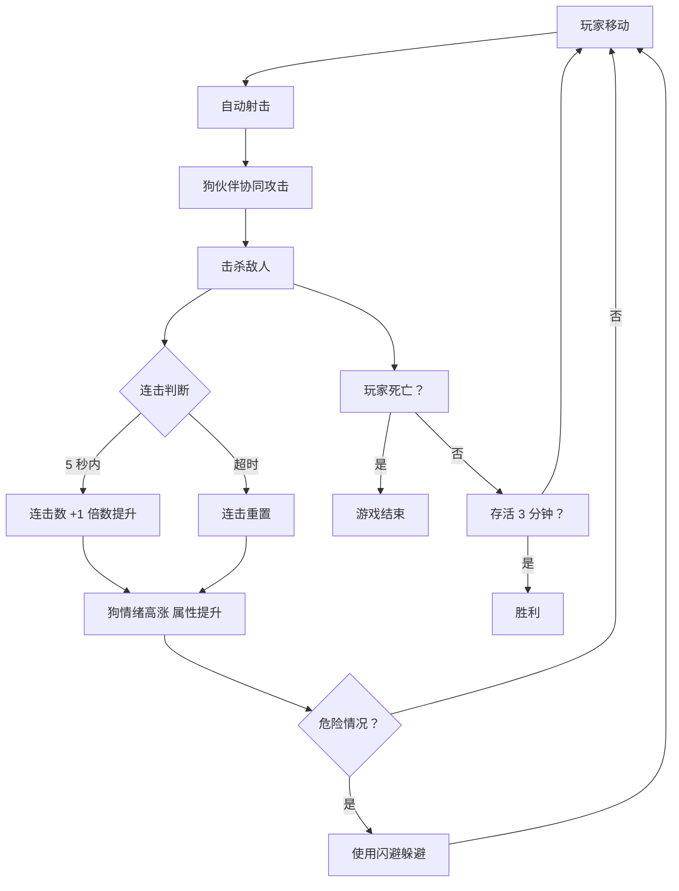

# M1 原型 Demo 开发计划（最终版）

> 版本：v4.0 | 日期：2026-03-11
> 阶段：M1 原型 Demo（1 周）
> 目标：极简操作 + 爽快战斗 + 创新玩法
> 核心理念：易上手，有深度，够创新

---

## 🎮 核心创新设计

### 创新点 1：狗伙伴协同作战系统 ⭐⭐⭐⭐⭐

**传统设计**：玩家单独战斗，宠物跟随
**创新设计**：玩家 + 狗伙伴**双角色协同作战**

```
玩家（人类）              狗伙伴（哈士奇）
├── 远程射击              ├── 近战撕咬
├── 移动控制              ├── 自动追踪敌人
└── 指挥技能              └── 独立 AI 战斗

协同效果：
- 狗吸引火力，玩家输出
- 狗减速敌人，玩家收割
- 连携攻击：狗定身 + 玩家暴击
```

### 创新点 2：连击 combo 系统 ⭐⭐⭐⭐⭐

**传统设计**：击杀敌人获得金币
**创新设计**：连续击杀积累连击倍数

```
连击系统：
- 5 秒内连续击杀 → 连击数 +1
- 连击倍数：1x → 2x → 3x → 5x → 10x
- 连击期间金币/伤害翻倍
- 断连后重置

爽点：
- 越打越强
- 追求高连击的快感
- 风险：为了维持连击需要冒险
```

### 创新点 3：狗伙伴情绪系统 ⭐⭐⭐⭐

**传统设计**：宠物固定属性
**创新设计**：狗有情绪状态，影响战斗

```
哈士奇情绪：
😄 开心（连杀时）→ 攻击速度 +50%
😠 愤怒（玩家受伤）→ 伤害 +30%
😰 害怕（血量低）→ 躲到玩家身后
😴 无聊（长时间没战斗）→ 打哈欠，属性降低

互动：
- 玩家靠近 → 摇尾巴
- 击杀敌人 → 转圈庆祝
- 玩家死亡 → 呜咽
```

### 创新点 4：动态难度曲线 ⭐⭐⭐

**传统设计**：固定刷新率
**创新设计**：根据玩家表现动态调整

```
表现好（高连击/低血量）：
→ 刷新率略微降低
→ 掉落更多金币
→ 给玩家喘息机会

表现差（低连击/高血量）：
→ 刷新率略微提高
→ 增加挑战性
→ 防止玩家无聊
```

---

## 📋 功能清单（优先级排序）

### P0 - 核心玩法（必须实现）

| 功能 | 描述 | 创新点 | 状态 |
|------|------|--------|------|
| 虚拟摇杆移动 | 左手摇杆控制移动 | 基础 | ✅ |
| 自动瞄准射击 | 自动攻击最近敌人 | 基础 | ✅ |
| 敌人追踪 AI | 敌人持续向玩家移动 | 基础 | ✅ |
| 碰撞伤害系统 | 敌人接触玩家造成伤害 | 基础 | ✅ |
| 连击系统 | 连续击杀积累倍数 | 连击 combo | ⏳ |
| 狗伙伴协同 | 哈士奇独立战斗 | 双角色协同 | ✅ |
| 狗情绪系统 | 狗有情绪状态 | 情绪系统 | ⏳ |

### P1 - 提升体验（应该实现）

| 功能 | 描述 | 创新点 | 状态 |
|------|------|--------|------|
| 敌人无限刷新 | 随时间增加刷新频率 | 动态难度 | ⏳ |
| 连击倍数显示 | UI 显示当前连击 | 连击 combo | ⏳ |
| 狗情绪显示 | UI 显示狗表情 | 情绪系统 | ⏳ |
| 金币掉落 | 击杀敌人获得金币 | 基础 | ✅ |
| 计分系统 | 击杀数/分数显示 | 基础 | ✅ |

### P2 - 锦上添花（可选实现）

| 功能 | 描述 | 创新点 | 状态 |
|------|------|--------|------|
| 狗技能 | 哈士奇冰霜冲刺 | 协同战斗 | ✅ |
| 连携攻击 | 狗定身 + 玩家暴击 | 协同战斗 | ⏳ |
| 动态难度 | 根据表现调整 | 动态难度 | ⏳ |
| 胜利条件 | 存活 3 分钟 | 基础 | ⏳ |
| 闪避系统 | 双击闪避（无增伤） | 操作深度 | ✅ |

---

## 🎯 核心玩法循环



---

## 📅 开发计划（1 周）

### Day 1-2: 连击 Combo 系统

| 任务 | 描述 | 工时 |
|------|------|------|
| T001 | 创建连击管理器 | 1h |
| T002 | 实现连击计数与计时器 | 2h |
| T003 | 实现连击倍数计算 | 1h |
| T004 | 连击 UI 显示 | 2h |
| T005 | 连击特效（数字飘字） | 2h |

**连击配置：**
```typescript
export const COMBO_CONFIG = {
    comboTime: 5,           // 5 秒内连续击杀
    thresholds: [5, 10, 20, 50],  // 连击数阈值
    multipliers: [1, 2, 3, 5, 10] // 对应倍数
};
```

### Day 3: 狗情绪系统

| 任务 | 描述 | 工时 |
|------|------|------|
| T006 | 创建情绪状态机 | 2h |
| T007 | 实现开心情绪（连杀） | 1h |
| T008 | 实现愤怒情绪（玩家受伤） | 1h |
| T009 | 实现害怕情绪（玩家低血量） | 1h |
| T010 | 实现无聊情绪（无战斗） | 1h |
| T011 | 狗情绪 UI 显示（表情） | 2h |

**情绪配置：**
```typescript
export const DOG_MOOD_CONFIG = {
    happy: {
        trigger: 'combo >= 10',
        effect: { attackSpeed: 0.5, damage: 1.0 },
        expression: '😄'
    },
    angry: {
        trigger: 'playerHp < 50%',
        effect: { attackSpeed: 1.0, damage: 1.3 },
        expression: '😠'
    },
    scared: {
        trigger: 'playerHp < 20%',
        effect: { attackSpeed: 0.5, damage: 0.5, followCloser: true },
        expression: '😰'
    },
    bored: {
        trigger: 'noKill > 10s',
        effect: { attackSpeed: 1.5, damage: 0.7 },
        expression: '😴'
    }
};
```

### Day 4: 敌人无限刷新系统

| 任务 | 描述 | 工时 |
|------|------|------|
| T012 | 实现敌人无限刷新 | 2h |
| T013 | 随时间增加刷新频率 | 2h |
| T014 | 动态难度调整 | 2h |

**刷新曲线：**
```typescript
// 第 0-60 秒：每秒 1 只懒狗
// 第 60-120 秒：每秒 1 只懒狗 + 每 2 秒 1 只疯狗
// 第 120-180 秒：每秒 2 只懒狗 + 每秒 1 只疯狗
```

### Day 5: 游戏流程完善

| 任务 | 描述 | 工时 |
|------|------|------|
| T015 | 游戏计时器 | 1h |
| T016 | 胜利条件（存活 3 分钟） | 1h |
| T017 | 游戏结束界面 | 2h |
| T018 | 重新开始功能 | 1h |
| T019 | 数值平衡测试 | 3h |

---

## 🎨 视觉与反馈设计

### 连击反馈
```
连击数显示：
- 位置：屏幕顶部居中
- 样式：大号数字 + 倍数
- 特效：数字缩放动画
- 颜色：白色 → 金色（高连击）

示例：
COMBO x5  🔥
```

### 狗情绪反馈
```
表情显示：
- 位置：狗伙伴头顶
- 样式：emoji 表情
- 持续时间：3 秒

特效：
- 开心：转圈 + 星星粒子
- 愤怒：红色气息 + 龇牙
- 害怕：颤抖 + 躲玩家身后
- 无聊：打哈欠 + Zzz 飘字
```

---

## 📊 数值配置总览

### 玩家基础属性
```typescript
PLAYER_CONFIG = {
    hp: 100,
    attack: 15,
    speed: 150,
    fireRate: 3,
    range: 400,
    critRate: 0.05,
    critDamage: 2.0
}
```

### 连击倍数
```typescript
COMBO_CONFIG = {
    thresholds: [5, 10, 20, 50],
    multipliers: [1, 2, 3, 5, 10]
}
```

### 狗情绪配置
```typescript
DOG_MOOD_CONFIG = {
    happy:   { combo >= 10,  attackSpeed +50% },
    angry:   { playerHp < 50%, damage +30% },
    scared:  { playerHp < 20%, follow closer },
    bored:   { noKill > 10s, attackSpeed -50% }
}
```

### 敌人配置
```typescript
ENEMY_CONFIG = {
    lazyDog: {
        hp: 50,        // 4 枪打死
        attack: 5,
        speed: 60,
        spawnRate: 1.0
    },
    crazyDog: {
        hp: 30,        // 2 枪打死
        attack: 8,
        speed: 120,
        spawnRate: 0.5
    }
}
```

---

## ✅ 验收标准

### 功能验收
- [x] 虚拟摇杆移动
- [x] 自动瞄准射击
- [ ] 连击 Combo 系统
- [ ] 狗情绪系统
- [ ] 狗伙伴协同攻击
- [ ] 敌人无限刷新
- [ ] 动态难度
- [ ] 胜利条件（存活 3 分钟）

### 创新验收
- [ ] 连击系统带来爽快感
- [ ] 狗情绪系统有情感连接
- [ ] 双角色协同有新意

### 体验验收
- [ ] 单手操作流畅
- [ ] 射击手感爽快
- [ ] 连击让人上瘾
- [ ] 狗伙伴有存在感
- [ ] 单局时长 3-5 分钟

### 性能验收
- [ ] 60fps 稳定运行
- [ ] 首次加载时间 < 3 秒
- [ ] 内存占用 < 200MB

---

## 🚀 创新点总结

| 创新点 | 描述 | 实现难度 | 爽快感 |
|--------|------|----------|--------|
| 连击 Combo | 连续击杀倍数提升 | ⭐⭐ | ⭐⭐⭐⭐⭐ |
| 狗情绪系统 | 狗有情感反馈 | ⭐⭐⭐ | ⭐⭐⭐⭐ |
| 双角色协同 | 玩家 + 狗独立战斗 | ⭐⭐ | ⭐⭐⭐⭐ |
| 动态难度 | 根据表现调整 | ⭐⭐⭐ | ⭐⭐⭐ |

---

## 📝 与竞品对比

| 特性 | 黎明前 20 分钟 | 原版计划 | 最终版 |
|------|----------------|----------|--------|
| 操作 | 单手移动 | 点击 + 射击 | 摇杆移动 |
| 攻击 | 完全自动 | 点击瞄准 | 自动瞄准 |
| 宠物 | 无 | 跟随 | 情绪 + 协同 |
| 闪避 | 无 | 基础闪避 | 基础闪避 |
| 连击 | 无 | 无 | Combo 倍数 |
| 难度 | 固定曲线 | 固定曲线 | 动态调整 |

---

*计划版本：v4.0 | 最后更新：2026-03-11*
*核心理念：简单操作 + 深度玩法 + 情感连接*
